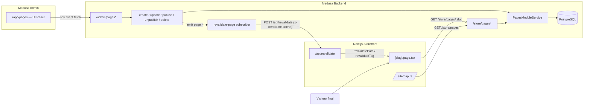
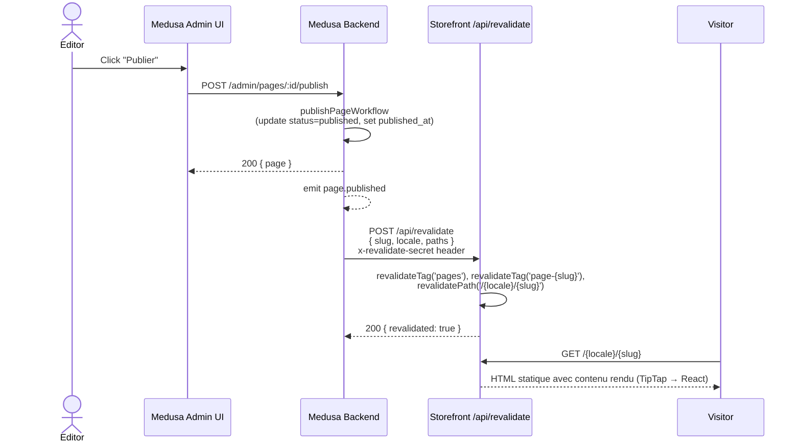

# Module Pages

Module Medusa v2 pour la gestion de pages éditoriales (À propos, FAQ, Livraison,
Mentions légales, etc.) avec éditeur TipTap riche, publication contrôlée,
preview des drafts et revalidation ISR du storefront Next.js.

## Fonctionnalités

- CRUD complet via le Medusa Admin (UI sous `/app/pages`)
- Éditeur TipTap (titres, listes, citations, code, images uploadées via `/admin/uploads`)
- Workflow de publication / dépublication avec event bus
- Soft-delete (slugs réutilisables après suppression via index partiel)
- Slug avec validation live (regex kebab-case, liste de réservés, unicité)
- Auto-save 30 s + indicateur visuel + garde `beforeunload`
- Mode preview signé par JWT (1 h, scope `preview`) pour voir les drafts
- Revalidation ISR Next.js déclenchée à chaque mutation
- Multilingue par row (`locale` + slug globalement uniques)
- SEO : meta_title, meta_description, og_image_url, aperçu Google live dans l'admin

## Architecture



### Flux "publier une page"



## Modèle de données

Table `page` (1 row = 1 page dans 1 locale).

| Champ | Type | Contraintes | Description |
|---|---|---|---|
| `id` | text PK | ULID auto | Identifiant unique |
| `slug` | text | partial unique `WHERE deleted_at IS NULL`, regex `^[a-z0-9]+(?:-[a-z0-9]+)*$`, pas dans une liste de réservés | URL slug, kebab-case |
| `title` | text | required, max 200 | Titre de la page |
| `content` | jsonb | nullable | Document TipTap au format JSON |
| `excerpt` | text | nullable, max 300 | Résumé court |
| `meta_title` | text | nullable, max 70 | SEO title (fallback : `title`) |
| `meta_description` | text | nullable, max 160 | SEO description |
| `og_image_url` | text | nullable | URL image Open Graph |
| `status` | enum (`draft`, `published`) | default `draft` | État de publication |
| `published_at` | timestamptz | nullable | Set au premier `publish`, conservé sur re-publish |
| `locale` | text | default `fr` | Code langue (BCP 47 minimum) |
| `created_at`, `updated_at`, `deleted_at` | timestamptz | auto, soft delete | Audit |

## API

### Routes admin (`/admin/pages*`)

Auth admin auto (cookie session ou bearer token).

| Méthode | Route | Description |
|---|---|---|
| `GET` | `/admin/pages` | Liste paginée (`?limit`, `?offset`, `?status`, `?locale`, `?q`, `?slug`) |
| `GET` | `/admin/pages/:id` | Détail complet |
| `POST` | `/admin/pages` | Création (`status = draft` par défaut) |
| `POST` | `/admin/pages/:id` | Update partiel |
| `DELETE` | `/admin/pages/:id` | Soft delete |
| `POST` | `/admin/pages/:id/publish` | Set `status = published` + `published_at` |
| `POST` | `/admin/pages/:id/unpublish` | Set `status = draft` |
| `GET` | `/admin/pages/preview-token` | Mint un JWT preview (1 h, scope=`preview`) |

### Routes store (`/store/pages*`)

Header `x-publishable-api-key` requis. La locale courante est lue depuis le
header `x-medusa-locale` (auto-injecté par le SDK) ou la query `?locale=`.

| Méthode | Route | Description |
|---|---|---|
| `GET` | `/store/pages` | Liste des pages publiées (sans `content`, fields publics seulement) |
| `GET` | `/store/pages/:slug` | Page complète. Drafts accessibles via `x-preview-token` (JWT signé avec `PREVIEW_SECRET`, ou la valeur brute du secret). |

## Workflows

Tous dans `src/workflows/pages/`. Composition + steps réutilisables avec compensation.

| Workflow | Step principal | Compensation | Event émis |
|---|---|---|---|
| `createPageWorkflow` | `createPageStep` | `deletePages(id)` | `page.created` |
| `updatePageWorkflow` | `updatePageStep` | restore snapshot `before` | `page.updated` |
| `publishPageWorkflow` | `publishPageStep` | restore status / `published_at` | `page.published` |
| `unpublishPageWorkflow` | `unpublishPageStep` | restore status | `page.unpublished` |
| `deletePageWorkflow` | `deletePageStep` | `restorePages(id)` | `page.deleted` |

**Note** : la validation business (regex slug, liste réservée, unicité) est
faite **dans les steps**, jamais dans les routes API (règle Medusa
`logic-workflow-validation`).

## Events émis

Payload : `{ id: string; slug?: string; locale?: string }`.

| Event | Quand |
|---|---|
| `page.created` | Après création (status = draft) |
| `page.updated` | Après update partiel |
| `page.published` | Après passage en `published` |
| `page.unpublished` | Après passage en `draft` depuis `published` |
| `page.deleted` | Après soft-delete (slug + locale capturés *avant* delete) |

Le subscriber `src/subscribers/revalidate-page.ts` écoute
`page.published`, `page.updated`, `page.unpublished`, `page.deleted` (pas
`page.created` — un draft sans contenu publié ne change rien sur le storefront).

## Variables d'environnement

| Var | Requis | Description |
|---|---|---|
| `STOREFRONT_URL` | oui | Base URL du storefront. Le subscriber POST sur `${STOREFRONT_URL}/api/revalidate` |
| `REVALIDATE_SECRET` | oui | Secret partagé backend ↔ storefront. Doit être identique aux 2 endroits |
| `PREVIEW_SECRET` | oui | Secret pour signer/vérifier les JWT preview. Idéalement ≠ `REVALIDATE_SECRET` |

Côté storefront, mêmes vars dans `apps/storefront/.env.local`. Optionnel :
`MEDUSA_BACKEND_HOSTNAME` + `MEDUSA_BACKEND_PROTOCOL` pour autoriser les images
uploadées via `next/image` en prod.

## Installation

```bash
# 1. Dépendances
pnpm install

# 2. Migration (crée la table `page`)
npx medusa db:migrate

# 3. (optionnel) Seed de pages d'exemple
npx medusa exec ./src/scripts/seed-pages.ts

# 4. Lancer en dev
pnpm dev
```

⚠️ **File provider** : par défaut Medusa utilise le provider local (stockage
dans `./static/`, exposé sur `http://localhost:9000/static/*`). Pour la prod,
configurer `@medusajs/file-s3` (ou MinIO) dans `medusa-config.ts`.

## Développement

### Lancer en local

Dans `apps/backend/.env` :

```
DATABASE_URL=postgres://…
STOREFRONT_URL=http://localhost:8000
REVALIDATE_SECRET=…
PREVIEW_SECRET=…
```

```bash
# Backend
pnpm dev                # http://localhost:9000 (admin sur /app)

# Storefront (autre terminal)
cd ../storefront
pnpm dev                # http://localhost:8000
```

### Lancer les tests d'intégration HTTP

```bash
pnpm test:integration:http
```

Nécessite un Postgres local avec droit `CREATE DATABASE` (le runner
crée une DB jetable par worker Jest). Les tests sont sous
`apps/backend/integration-tests/http/{admin,store}-pages.spec.ts`.

### Ajouter une extension TipTap

1. Installer le package : `pnpm add @tiptap/extension-X@^3.23.1` (rester en
   v3 pour la cohérence)
2. L'ajouter dans `src/admin/components/tiptap-editor/extensions.ts`
3. Si elle a un node visible, ajouter le rendu correspondant dans
   `apps/storefront/src/lib/tiptap-renderer.tsx`
4. (optionnel) Ajouter un bouton dans `toolbar.tsx`

### Customiser le renderer storefront

`tiptap-renderer.tsx` est volontairement simple : un `switch` sur `node.type`.
Pour ajouter un node custom (par exemple un `productCard`) :

```ts
case "productCard":
  return <ProductCardEmbed key={key} productId={node.attrs?.id as string} />
```

Si le contenu d'une page contient des nodes inconnus, ils sont silencieusement
ignorés en prod (warning console en dev).

## Tests

### Couverture

- ✅ **Build** : `pnpm build` doit passer (vérification TypeScript + bundle admin)
- ⚠️ **Tests d'intégration HTTP** : écrits (`admin-pages.spec.ts`, `store-pages.spec.ts`)
  mais nécessitent un Postgres local (le runner Medusa crée une DB jetable
  par worker — non compatible avec un Postgres distant qui ferme les
  connections longues)
- ❌ **Tests unitaires du renderer storefront** : pas écrits (le storefront
  n'a pas de framework de test installé). Le renderer est 100 % pur fonction
  → testable avec n'importe quel runner ajouté plus tard
- ❌ **Tests E2E (Playwright)** : pas écrits

### Test manuel rapide

```bash
# 1. Auth + token
TOKEN=$(curl -s -X POST http://localhost:9000/auth/user/emailpass \
  -H "Content-Type: application/json" \
  -d '{"email":"admin@…","password":"…"}' | jq -r .token)

# 2. Créer une page
curl -X POST http://localhost:9000/admin/pages \
  -H "Authorization: Bearer $TOKEN" \
  -H "Content-Type: application/json" \
  -d '{"slug":"test","title":"Test","locale":"fr"}'

# 3. Publier
curl -X POST http://localhost:9000/admin/pages/<id>/publish \
  -H "Authorization: Bearer $TOKEN"

# 4. Lire côté store (publishable key requise)
curl -H "x-publishable-api-key: pk_…" \
  http://localhost:9000/store/pages/test
```

## Limites connues

- **Pas de versioning** : aucun historique de révisions, on travaille toujours
  sur la version courante. Pour un audit ou un rollback, regarder les events
  + le payload Medusa events log.
- **Multilingue basique** : un champ `locale` par row, **pas de
  `translation_group_id`** ni de liaison entre versions traduites. Pour
  changer de langue côté storefront, il faut connaître le slug exact de la
  traduction. Choix volontaire pour la v1 — à enrichir si besoin.
- **CGV / Mentions légales éditables comme une page normale** : pour de la
  conformité juridique stricte, considère hardcoder ou ajouter un flag
  `system: true` qui empêche la suppression.
- **`generateStaticParams` au build** : chaque slug ajouté après le build
  est rendu dynamiquement à la première visite (acceptable, ISR fallback 1h).
  Pour pré-générer, redéployer.
- **Sitemap** : `app/sitemap.ts` couvre les pages éditoriales. Le
  `next-sitemap.js` postbuild couvre le reste du storefront. Pas de fusion
  pour l'instant.

## Troubleshooting

| Symptôme | Cause probable | Solution |
|---|---|---|
| La revalidation ne se déclenche pas (visible dans les logs storefront) | `REVALIDATE_SECRET` différent entre `apps/backend/.env` et `apps/storefront/.env.local` | Vérifier que les 2 fichiers ont la même valeur — c'est l'erreur la plus fréquente |
| Subscriber log : `fetch failed` | Storefront pas démarré, ou `STOREFRONT_URL` incorrect dans `.env` backend | Démarrer le storefront (`pnpm dev` dans `apps/storefront`) ou ajuster `STOREFRONT_URL` |
| L'éditeur affiche une page blanche dans l'admin | Mismatch de versions TipTap (v2 vs v3 mélangées) | `pnpm list "@tiptap/*" --depth=10` doit retourner une seule version majeure (3.x) partout |
| Les images ne s'affichent pas dans l'éditeur après upload | File provider local + URL backend non accessible | Vérifier `http://localhost:9000/static/<filename>` directement. En prod, configurer S3/MinIO |
| Côté storefront, image OG en `next/image` ne s'affiche pas | Domaine pas dans `next.config.js → images.remotePatterns` | Ajouter `MEDUSA_BACKEND_HOSTNAME` env var, ou un bloc dédié dans `next.config.js` |
| Erreur "Unique constraint slug" lors d'une création | Slug en conflit, peut-être soft-deleted | `SELECT slug, deleted_at FROM page WHERE slug = '…'`. Si soft-deleted : restaurer (`UPDATE page SET deleted_at = NULL`) ou choisir un autre slug |
| Le mode preview affiche 404 sur le storefront | Token JWT expiré (>1 h) ou `PREVIEW_SECRET` différent entre les 2 apps | Régénérer depuis l'admin (re-cliquer "Voir le site") ; vérifier les `.env` |
| Le filtre `?locale=` est ignoré sur `/store/pages` | Comportement normal : Medusa intercepte `?locale=` via `applyLocale` middleware sur `/store/*` et le set sur `req.locale` | Le filtre **est** appliqué côté backend via `req.locale` ; cf. `src/api/store/pages/route.ts` |
| L'auto-save log boucle ou fait des requêtes en rafale | Effet React mal mémoïsé, ou `save` callback recréé à chaque render | `useAutoSave` utilise un `saveRef` interne — vérifier que la prop `save` ne crée pas une nouvelle fonction à chaque render parent (entourer de `useCallback`) |
| Slug mis à jour automatiquement à chaque frappe du titre sur une page existante | Le cadenas est ouvert (auto-gen activé) | Cliquer le cadenas pour le fermer ; sur les pages existantes, il devrait être fermé par défaut |
| `pnpm dev` backend renvoie EADDRINUSE :9000 | Souvent php-fpm ou un autre service occupe le port en local | `lsof -ti :9000` puis kill, ou démarrer Medusa sur un autre port via `PORT=9100 pnpm dev` (et ajuster `MEDUSA_BACKEND_URL` côté storefront) |
| Test runner Medusa échoue avec `terminating connection due to administrator command` | Postgres distant ferme les connections longues pendant les migrations du test runner | Utiliser un Postgres local (Docker : `docker run -d -p 5432:5432 -e POSTGRES_PASSWORD=test postgres:16`) avec `.env.test` |

## Liens

- [Medusa v2 docs — Custom modules](https://docs.medusajs.com/learn/fundamentals/modules)
- [TipTap v3 docs](https://tiptap.dev/docs/editor/introduction)
- [Next.js App Router — Revalidating data](https://nextjs.org/docs/app/building-your-application/data-fetching/incremental-static-regeneration)
